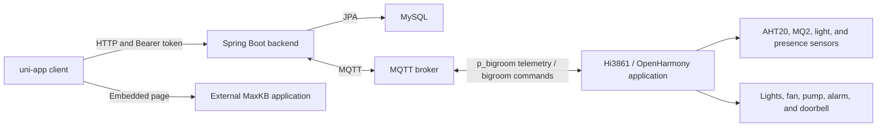

# Yijia Smart Home

[English](README.md) | [简体中文](README.zh-CN.md)

Yijia is a smart-home prototype that connects a uni-app client, a Spring Boot backend, MQTT messaging, and a Hi3861/OpenHarmony device application. It models homes, rooms, members, devices, operation records, and scenes while linking the software interface to environmental sensors and physical controls.

## What the Project Demonstrates

- **A household-oriented domain model:** homes contain rooms and devices, while member records associate users with a home and a role.
- **A two-way IoT path:** the Hi3861 application publishes room telemetry, the backend parses and stores it, and client actions are translated into MQTT control messages.
- **Software-to-hardware control:** room pages map lights, fans, pumps, alarms, and the doorbell to command fields understood by the device application.
- **Scene composition:** scenes group device actions and can be created, edited, listed, and activated; the client also evaluates local time and presence conditions.
- **External service integration:** email supports registration and password-reset codes, while an embedded page provides an entry point to a separately deployed MaxKB chat application.

## Core Workflows

```text
Account and household
Register or sign in -> select a home -> browse rooms -> inspect devices

Device control
Open a room -> select a light or fan -> send a control command -> publish to bigroom -> Hi3861 applies the command

Telemetry
Hi3861 samples sensors -> publish JSON to p_bigroom -> backend parses and stores telemetry -> client queries current data

Scenes
Select a home -> create a scene -> choose device actions and a trigger -> save -> activate manually or evaluate locally

AI page
Open the AI tab -> load the configured external MaxKB chat page -> interact with that deployed service
```

The AI page is an iframe integration point. This repository does not implement an AI model or a completed MaxKB backend API workflow.

## Architecture



## Quick Start

### 1. Prepare the environment

Install or provide:

- JDK 8
- MySQL
- An MQTT broker
- HBuilderX with uni-app support
- Node.js/npm when the selected HBuilderX target requires npm dependencies

SMTP is required only for registration verification and password reset. A deployed MaxKB chat application is required only for the AI page. The Hi3861/OpenHarmony SDK and hardware are required only for the physical-device path.

### 2. Create the database

```sql
CREATE DATABASE smart CHARACTER SET utf8mb4 COLLATE utf8mb4_unicode_ci;
```

The backend uses Hibernate `ddl-auto=update` to create or update its tables.

### 3. Configure the backend

Set the environment variables before startup. `JWT_SECRET_KEY` must contain at least 32 bytes because the backend creates an HS256 signing key from it.

```powershell
$env:DB_USERNAME = "root"
$env:DB_PASSWORD = "your-database-password"
$env:JWT_SECRET_KEY = "replace-with-a-secret-of-at-least-32-bytes"
$env:MQTT_BROKER_URL = "tcp://localhost:1883"
$env:MQTT_USERNAME = ""
$env:MQTT_PASSWORD = ""
```

For email flows, also set:

```powershell
$env:SPRING_MAIL_HOST = "smtp.example.com"
$env:MAIL_USERNAME = "your-smtp-account"
$env:MAIL_PASSWORD = "your-smtp-app-password"
```

The complete backend defaults and placeholders are in `backend/src/main/resources/application.properties`.

### 4. Start the backend

From `backend/`:

```powershell
.\mvnw.cmd clean package
.\mvnw.cmd spring-boot:run
```

The API listens on `http://localhost:8088`.

### 5. Configure and run the client

The client API base URL is defined in `frontend/libs/request/index.js` and defaults to `http://localhost:8088`. Replace `localhost` with the development machine's reachable address when running on a phone or emulator.

```powershell
cd frontend
npm install
```

Open `frontend/` in HBuilderX and run the required uni-app target. Use the browser, emulator, or device address displayed by HBuilderX to access the client. The repository does not define a standalone npm build script.

To use the AI tab, replace the placeholder URL in `frontend/pages/ai/ai.vue` with the URL of a deployed MaxKB chat page before running the client.

### 6. Connect the Hi3861 application (optional)

```powershell
Copy-Item firmware/hi3861-bigroom/config.example.h firmware/hi3861-bigroom/config.h
```

Set the Wi-Fi SSID, Wi-Fi password, MQTT broker host, and MQTT port in `config.h`, add `firmware/hi3861-bigroom/` to a compatible OpenHarmony source tree, and build it with that SDK's Hi3861 workflow. The firmware and backend must connect to the same MQTT broker.

## Representative API Examples

These examples use the backend's default address. The client stores the token returned by login and adds it as a Bearer token to subsequent requests.

### Sign in

`POST /api/auth/login` accepts a phone number or email address and returns the JWT as a plain response string.

```bash
curl -X POST http://localhost:8088/api/auth/login \
  -H "Content-Type: application/json" \
  -d '{"identifier":"13800000000","password":"example-password"}'
```

```text
eyJhbGciOiJIUzI1NiJ9...
```

### Get user information

`GET /api/auth/user?phone=...` returns the matching user with the password field cleared by the controller.

```bash
curl "http://localhost:8088/api/auth/user?phone=13800000000" \
  -H "Authorization: Bearer <token>"
```

### List a user's homes

`GET /home/user/{userId}` returns the homes associated with a user.

```bash
curl http://localhost:8088/home/user/1 \
  -H "Authorization: Bearer <token>"
```

### Send a device command

`POST /api/mqtt/send` publishes the supplied message to an MQTT topic. This is the same endpoint used by the client-side device helpers.

```bash
curl -X POST "http://localhost:8088/api/mqtt/send?topic=bigroom&message=liv_lit%3D1" \
  -H "Authorization: Bearer <token>"
```

This sends `liv_lit=1`, which the current firmware interprets as a living-room light command.

There is no local AI REST endpoint to demonstrate: `frontend/pages/ai/ai.vue` loads an external MaxKB page directly.

## MQTT Topics

The default topics are configured by `mqtt.topic=p_bigroom,bigroom` in the backend and are also present in the Hi3861 application.

| Topic | Direction | Purpose | Payload |
| --- | --- | --- | --- |
| `p_bigroom` | Hi3861 publishes; backend subscribes | Room state and sensor telemetry | JSON containing fields such as `temperature`, `humidity`, `gas`, `isHuman`, `liv_lit`, `fan_level`, and `water_pump_level` |
| `bigroom` | Backend publishes; Hi3861 subscribes | Device control | Text commands such as `liv_lit=1`, `kit_lit=0`, or `fan_level=2` |

Representative telemetry payload:

```json
{
  "liv_lit": 1,
  "kit_lit": 0,
  "tol_lit": 0,
  "senser_on": 1,
  "fan_level": 2,
  "water_pump_level": 0,
  "bell": 0,
  "temperature": 24.6,
  "humidity": 51.2,
  "gas": 183,
  "adcdata": 628,
  "isHuman": 1,
  "sun": 1,
  "senser_light": 1,
  "alarmbell": 0
}
```

## Tech Stack

- Client: uni-app, Vue 2-style single-file components, uView/uview-plus, Pinia, and MQTT.js
- Backend: Java 8, Spring Boot 2.7.6, Spring Web, Spring Data JPA, Spring Security, JJWT, Spring Integration MQTT, Eclipse Paho, Spring Mail, and Springfox
- Storage and messaging: MySQL and MQTT
- Device application: C, OpenHarmony/Hi3861, CMSIS-RTOS, GPIO, PWM, AHT20, MQ2, and Paho MQTTPacket

## Repository Layout

```text
.
|-- frontend/                  # uni-app client and pages
|-- backend/                   # REST API, persistence, email, and MQTT integration
`-- firmware/
    `-- hi3861-bigroom/        # Hi3861/OpenHarmony device application
```

## Authentication Boundary

Login issues a JWT and the client sends it in the `Authorization` header. The backend parses valid tokens, but the current Spring Security rule uses `permitAll()` for every route. Consequently, authentication is not enforced for any backend endpoint, including user, home, room, device, scene, log, and MQTT management routes.

This is a prototype limitation. Do not expose the current backend directly to an untrusted network or use it as a production authorization design. A production version should require authentication by default, derive the user identity from the security context, apply ownership or role checks at service boundaries, and restrict CORS and diagnostic endpoints.

## Current Limitations

- Scene controllers use a placeholder user ID, and scene ownership checks are incomplete.
- The AI feature is an embedded external page rather than an in-repository AI service.
- API and AI page addresses are fixed to local development values in the client.
- Verification codes are stored in backend memory and are lost when the process restarts.
- The frontend is HBuilderX-oriented and has no standalone npm build script.
- Full operation depends on separately configured MySQL, MQTT, SMTP, MaxKB, HBuilderX, and OpenHarmony environments.
