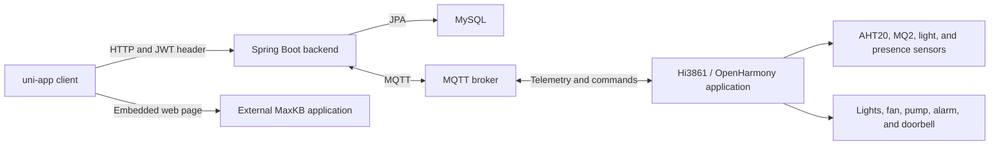

# Yijia Smart Home

[English](README.md) | [简体中文](README.zh-CN.md)

Yijia is a smart-home prototype that combines a uni-app client, a Spring Boot backend, MQTT messaging, and a Hi3861/OpenHarmony device application. It provides household and room management, device telemetry and control, scene configuration, and an integration point for an external MaxKB chat page.

## Features

- User registration, login, email verification, password reset, and JWT issuance
- Home, room, family-member, and guest management
- Device registration, assignment, status queries, and control
- Operation logs and recent activity queries
- Scene creation, editing, manual execution, and client-side time or presence checks
- MQTT telemetry ingestion and command publishing
- Temperature, humidity, gas, light, and presence sensing
- Light, fan, pump, alarm, and doorbell control in the Hi3861 application
- An embedded page for a separately deployed MaxKB chat application

## Architecture



The client stores the token returned at login and attaches it as a Bearer token to API requests. In the current backend configuration, however, all routes are permitted anonymously; JWT-based route authorization is not yet enforced.

## Tech Stack

- Client: uni-app, Vue 2-style single-file components, uView/uview-plus, Pinia, and MQTT.js
- Backend: Java 8, Spring Boot 2.7.6, Spring Web, Spring Data JPA, Spring Security, JJWT, Spring Integration MQTT, Eclipse Paho, Spring Mail, and Springfox
- Storage and messaging: MySQL and MQTT
- Device application: C, OpenHarmony/Hi3861, CMSIS-RTOS, GPIO, PWM, AHT20, MQ2, Paho MQTTPacket, and GN

## Repository Layout

```text
.
|-- frontend/                  # uni-app client
|-- backend/                   # REST API, persistence, email, and MQTT integration
`-- firmware/
    `-- hi3861-bigroom/        # Hi3861/OpenHarmony device application
```

## Backend Setup

### Prerequisites

- JDK 8
- MySQL
- An MQTT broker
- An SMTP account if verification-code and password-reset flows are required

The Maven Wrapper is included.

### Configuration

Create a MySQL database named `smart`, then set the required environment variables before starting the backend.

| Variable | Purpose | Application default |
| --- | --- | --- |
| `DB_URL` | MySQL JDBC URL | `jdbc:mysql://localhost:3306/smart` |
| `DB_USERNAME` | MySQL user | `root` |
| `DB_PASSWORD` | MySQL password | Empty |
| `JWT_SECRET_KEY` | JWT signing key; must be at least 32 bytes | No usable default |
| `MQTT_BROKER_URL` | MQTT broker URL | `tcp://localhost:1883` |
| `MQTT_CLIENT_ID` | Backend MQTT client ID | `smarthome-backend` |
| `MQTT_USERNAME` | MQTT user | Empty |
| `MQTT_PASSWORD` | MQTT password | Empty |
| `SPRING_MAIL_HOST` | SMTP host | Not configured |
| `MAIL_USERNAME` | SMTP account | Empty |
| `MAIL_PASSWORD` | SMTP app password | Empty |
| `MAXKB_BASE_URL` | MaxKB API base URL reserved by backend configuration | Local placeholder |
| `MAXKB_API_KEY` | MaxKB API key reserved by backend configuration | Empty |

Example PowerShell configuration:

```powershell
$env:DB_USERNAME = "root"
$env:DB_PASSWORD = "your-database-password"
$env:JWT_SECRET_KEY = "replace-with-a-secret-of-at-least-32-bytes"
$env:MQTT_BROKER_URL = "tcp://localhost:1883"
$env:SPRING_MAIL_HOST = "smtp.example.com"
$env:MAIL_USERNAME = "your-smtp-account"
$env:MAIL_PASSWORD = "your-smtp-app-password"
```

Build and run from `backend/`:

```powershell
.\mvnw.cmd clean package
.\mvnw.cmd spring-boot:run
```

The API listens on `http://localhost:8088` by default. Hibernate uses `ddl-auto=update` for schema creation and updates.

## Client Setup

Open `frontend/` as a uni-app project in HBuilderX. Install the npm dependencies when required by the selected HBuilderX target:

```powershell
npm install
```

Run the desired uni-app target from HBuilderX. This frontend does not define a standalone npm build script.

API requests currently use `http://localhost:8088`. For a phone or emulator, replace `localhost` in `frontend/libs/request/index.js` with an address that can reach the development machine. The AI page URL is configured separately in `frontend/pages/ai/ai.vue` and must point to a deployed MaxKB chat page.

## Firmware Setup

The device application is designed to be added to a compatible Hi3861/OpenHarmony source tree.

1. Create the local configuration header:

   ```powershell
   Copy-Item firmware/hi3861-bigroom/config.example.h firmware/hi3861-bigroom/config.h
   ```

2. Set the Wi-Fi SSID, Wi-Fi password, MQTT broker host, and MQTT port in `config.h`.

3. Add the application to the target OpenHarmony build and compile it using that SDK's Hi3861 workflow.

## Current Limitations

- Spring Security currently permits every backend route anonymously, including management APIs.
- Scene ownership checks use a placeholder user ID and do not provide complete authorization.
- The visible AI feature is an embedded external page; there is no in-repository AI model or completed MaxKB backend workflow.
- API and AI page addresses are fixed to local development values in the client.
- Verification codes are stored in backend memory and are lost when the process restarts.
- The project depends on separately configured MySQL, MQTT, SMTP, MaxKB, HBuilderX, and OpenHarmony environments.
