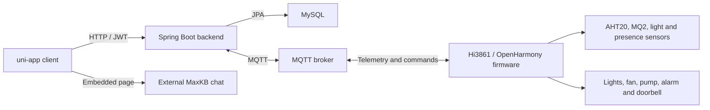

# Yijia Smart Home

[English](README.md) | [简体中文](README.zh-CN.md)

Yijia is an end-to-end smart home prototype with a uni-app client, a Spring Boot backend, MQTT communication, and Hi3861/OpenHarmony device firmware. It connects household management, environmental sensing, automation scenes, and physical device control in one project.

## Implemented Capabilities

- Registration, login, email verification, password reset, and JWT authentication
- Multiple homes, rooms, members, guests, and role-based permissions
- Device creation, movement, lookup, update, deletion, and control
- Operation logs and recent activity queries
- Time-based and presence-based local automation scenes
- MQTT publishing, subscription, telemetry storage, and device commands
- Temperature, humidity, gas, light, and human-presence telemetry
- Light, fan, water-pump, sensor, alarm, and doorbell control in the Hi3861 firmware
- An embedded AI page designed to connect to an externally deployed MaxKB chat application

The source materials discuss broader RAG and MCP goals. This repository only describes the MaxKB page integration that is visible in the current code and does not claim a complete MCP implementation.

## Architecture



## Tech Stack

- Client: uni-app, Vue single-file components, uView/uview-plus, Pinia, MQTT.js
- Backend: Java 8, Spring Boot 2.7.6, Spring Web, Spring Data JPA, Spring Security, JWT, Spring Integration MQTT, Eclipse Paho, Mail, Springfox
- Data: MySQL and MQTT telemetry
- Firmware: C, OpenHarmony/Hi3861, CMSIS-RTOS, GPIO, PWM, AHT20, MQ2, Paho MQTTPacket, GN

## Repository Layout

```text
.
|-- frontend/                  # uni-app client
|-- backend/                   # Spring Boot API and MQTT service
`-- firmware/
    `-- hi3861-bigroom/        # OpenHarmony device application
```

## Backend Setup

Prerequisites: JDK 8, MySQL, and an MQTT broker. The Maven Wrapper is included.

The backend configuration is public-safe and reads secrets from environment variables:

| Variable | Purpose | Default |
| --- | --- | --- |
| `DB_URL` | MySQL JDBC URL | `jdbc:mysql://localhost:3306/smart` |
| `DB_USERNAME` | MySQL user | `root` |
| `DB_PASSWORD` | MySQL password | empty |
| `JWT_SECRET_KEY` | JWT signing key | development placeholder |
| `MQTT_BROKER_URL` | MQTT broker URL | `tcp://localhost:1883` |
| `MQTT_CLIENT_ID` | Backend MQTT client ID | `smarthome-backend` |
| `MQTT_USERNAME` | MQTT user | empty |
| `MQTT_PASSWORD` | MQTT password | empty |
| `MAIL_HOST` | SMTP host | `smtp.qq.com` |
| `MAIL_USERNAME` | SMTP account | empty |
| `MAIL_PASSWORD` | SMTP app password | empty |
| `MAXKB_BASE_URL` | MaxKB application API URL | local placeholder |
| `MAXKB_API_KEY` | MaxKB application key | empty |

Create a `smart` database, set the required variables, and run from `backend/`:

```powershell
.\mvnw.cmd spring-boot:run
```

The default API port is `8088`.

## Client Setup

Open `frontend/` as a uni-app project in HBuilderX. Install npm dependencies when your HBuilderX workflow requires them:

```powershell
npm install
```

The public copy uses `http://localhost:8088` for backend calls and a placeholder local URL for the MaxKB page. When testing on a phone or emulator, replace `localhost` with the development machine's reachable LAN address. A separately deployed MaxKB chat application is required for the AI page.

The project contains both older uView-style components and newer `uni_modules`. They are retained because the current pages reference both layouts. The existing bootstrap and `manifest.json` should be treated as the source of truth for the HBuilderX build rather than assuming a standard standalone Vite project.

## Firmware Setup

The firmware directory is intended to be placed in a compatible Hi3861/OpenHarmony source tree. Create the private configuration header before building:

```powershell
Copy-Item firmware/hi3861-bigroom/config.example.h firmware/hi3861-bigroom/config.h
```

Edit `config.h` with the local Wi-Fi network and MQTT broker. `config.h` is ignored by Git and must never contain committed credentials.

## Public Repository Scope

This repository intentionally excludes production credentials, private QR codes, personal avatars, generated packages, IDE state, compiled output, source archives, raw course reports, API exports containing tokens, and local database data. The original uView README and root license were also excluded because they describe the upstream UI library rather than this application.
