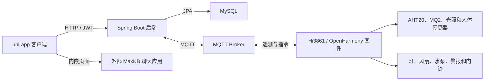

# Yijia 智能家居

[English](README.md) | [简体中文](README.zh-CN.md)

Yijia 是一个端到端智能家居原型，包含 uni-app 客户端、Spring Boot 后端、MQTT 通信和 Hi3861/OpenHarmony 设备固件，将家庭管理、环境感知、自动化场景和实体设备控制整合在一个项目中。

## 已实现能力

- 注册、登录、邮箱验证、密码重置和 JWT 身份认证
- 多家庭、房间、成员、访客和基于角色的权限
- 设备创建、移动、查询、更新、删除和控制
- 操作日志和近期活动查询
- 基于时间和人员状态的本地自动化场景
- MQTT 发布、订阅、遥测数据存储和设备指令
- 温度、湿度、燃气、光照和人体存在感知数据
- Hi3861 固件中的灯、风扇、水泵、传感器、警报和门铃控制
- 可连接外部 MaxKB 聊天应用的内嵌 AI 页面

原始资料还讨论了更广泛的 RAG 和 MCP 目标。本仓库只描述当前代码中可见的 MaxKB 页面集成，不宣称已经完成完整的 MCP 实现。

## 系统架构



## 技术栈

- 客户端：uni-app、Vue 单文件组件、uView/uview-plus、Pinia、MQTT.js
- 后端：Java 8、Spring Boot 2.7.6、Spring Web、Spring Data JPA、Spring Security、JWT、Spring Integration MQTT、Eclipse Paho、Mail、Springfox
- 数据：MySQL 和 MQTT 遥测数据
- 固件：C、OpenHarmony/Hi3861、CMSIS-RTOS、GPIO、PWM、AHT20、MQ2、Paho MQTTPacket、GN

## 目录结构

```text
.
|-- frontend/                  # uni-app 客户端
|-- backend/                   # Spring Boot API 和 MQTT 服务
`-- firmware/
    `-- hi3861-bigroom/        # OpenHarmony 设备应用
```

## 后端运行

环境要求：JDK 8、MySQL 和 MQTT Broker。项目包含 Maven Wrapper。

后端配置已按公开发布要求处理，通过环境变量读取敏感配置：

| 变量 | 用途 | 默认值 |
| --- | --- | --- |
| `DB_URL` | MySQL JDBC 地址 | `jdbc:mysql://localhost:3306/smart` |
| `DB_USERNAME` | MySQL 用户 | `root` |
| `DB_PASSWORD` | MySQL 密码 | 空 |
| `JWT_SECRET_KEY` | JWT 签名密钥 | 开发占位值 |
| `MQTT_BROKER_URL` | MQTT Broker 地址 | `tcp://localhost:1883` |
| `MQTT_CLIENT_ID` | 后端 MQTT 客户端 ID | `smarthome-backend` |
| `MQTT_USERNAME` | MQTT 用户 | 空 |
| `MQTT_PASSWORD` | MQTT 密码 | 空 |
| `MAIL_HOST` | SMTP 主机 | `smtp.qq.com` |
| `MAIL_USERNAME` | SMTP 账户 | 空 |
| `MAIL_PASSWORD` | SMTP 应用密码 | 空 |
| `MAXKB_BASE_URL` | MaxKB 应用 API 地址 | 本地占位地址 |
| `MAXKB_API_KEY` | MaxKB 应用密钥 | 空 |

创建名为 `smart` 的数据库，设置所需变量后，在 `backend/` 目录运行：

```powershell
.\mvnw.cmd spring-boot:run
```

默认 API 端口为 `8088`。

## 客户端运行

使用 HBuilderX 打开 `frontend/` 作为 uni-app 项目。根据 HBuilderX 工作流需要安装 npm 依赖：

```powershell
npm install
```

公开副本使用 `http://localhost:8088` 调用后端，并使用本地占位地址作为 MaxKB 页面地址。使用手机或模拟器测试时，应将 `localhost` 替换为开发机可访问的局域网地址。AI 页面需要一个单独部署的 MaxKB 聊天应用。

项目同时保留了旧版 uView 风格组件和新版 `uni_modules`，因为当前页面同时引用了两类布局。HBuilderX 构建时应以现有启动配置和 `manifest.json` 为准，不要假设它是标准的独立 Vite 项目。

## 固件运行

固件目录需要放入兼容的 Hi3861/OpenHarmony 源码树中。构建前创建私有配置头文件：

```powershell
Copy-Item firmware/hi3861-bigroom/config.example.h firmware/hi3861-bigroom/config.h
```

在 `config.h` 中填写本地 Wi-Fi 网络和 MQTT Broker 配置。`config.h` 已被 Git 忽略，绝不能提交真实凭据。

## 公开范围说明

本仓库明确排除了生产凭据、私人二维码、个人头像、生成包、IDE 状态、编译输出、源码压缩包、原始课程报告、包含 Token 的 API 导出文件和本地数据库数据。原始 uView README 和根目录许可证也未纳入，因为它们描述的是上游 UI 库而非本应用。
