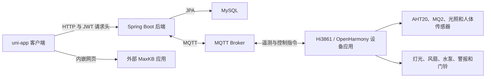

# Yijia 智能家居

[English](README.md) | [简体中文](README.zh-CN.md)

Yijia 是一个智能家居原型项目，由 uni-app 客户端、Spring Boot 后端、MQTT 消息通信和 Hi3861/OpenHarmony 设备应用组成，提供家庭与房间管理、设备遥测与控制、场景配置，以及外部 MaxKB 聊天页面的集成入口。

## 主要功能

- 用户注册、登录、邮箱验证码、密码重置和 JWT 签发
- 家庭、房间、家庭成员和访客管理
- 设备注册、归属设置、状态查询和控制
- 操作日志和近期活动查询
- 场景创建、编辑、手动执行，以及客户端侧的定时或人员状态检查
- MQTT 遥测数据接收和控制指令发布
- 温度、湿度、燃气、光照和人体存在状态采集
- Hi3861 设备应用中的灯光、风扇、水泵、警报和门铃控制
- 用于接入独立部署 MaxKB 聊天应用的内嵌页面

## 系统架构



客户端会保存登录接口返回的 token，并通过 Bearer 请求头发送给后端。不过，当前后端配置允许匿名访问所有路由，尚未真正执行基于 JWT 的接口授权。

## 技术栈

- 客户端：uni-app、Vue 2 风格单文件组件、uView/uview-plus、Pinia、MQTT.js
- 后端：Java 8、Spring Boot 2.7.6、Spring Web、Spring Data JPA、Spring Security、JJWT、Spring Integration MQTT、Eclipse Paho、Spring Mail、Springfox
- 存储与消息：MySQL、MQTT
- 设备应用：C、OpenHarmony/Hi3861、CMSIS-RTOS、GPIO、PWM、AHT20、MQ2、Paho MQTTPacket、GN

## 目录结构

```text
.
|-- frontend/                  # uni-app 客户端
|-- backend/                   # REST API、数据持久化、邮件和 MQTT 集成
`-- firmware/
    `-- hi3861-bigroom/        # Hi3861/OpenHarmony 设备应用
```

## 后端运行

### 环境要求

- JDK 8
- MySQL
- MQTT Broker
- 如需使用验证码和密码重置流程，还需准备 SMTP 账号

项目包含 Maven Wrapper。

### 配置

先创建名为 `smart` 的 MySQL 数据库，再设置后端所需的环境变量。

| 变量 | 用途 | 应用默认值 |
| --- | --- | --- |
| `DB_URL` | MySQL JDBC 地址 | `jdbc:mysql://localhost:3306/smart` |
| `DB_USERNAME` | MySQL 用户 | `root` |
| `DB_PASSWORD` | MySQL 密码 | 空 |
| `JWT_SECRET_KEY` | JWT 签名密钥，长度至少为 32 字节 | 无可用默认值 |
| `MQTT_BROKER_URL` | MQTT Broker 地址 | `tcp://localhost:1883` |
| `MQTT_CLIENT_ID` | 后端 MQTT 客户端 ID | `smarthome-backend` |
| `MQTT_USERNAME` | MQTT 用户 | 空 |
| `MQTT_PASSWORD` | MQTT 密码 | 空 |
| `SPRING_MAIL_HOST` | SMTP 主机 | 未配置 |
| `MAIL_USERNAME` | SMTP 账号 | 空 |
| `MAIL_PASSWORD` | SMTP 应用密码 | 空 |
| `MAXKB_BASE_URL` | 后端配置中预留的 MaxKB API 地址 | 本地占位地址 |
| `MAXKB_API_KEY` | 后端配置中预留的 MaxKB API Key | 空 |

PowerShell 配置示例：

```powershell
$env:DB_USERNAME = "root"
$env:DB_PASSWORD = "your-database-password"
$env:JWT_SECRET_KEY = "replace-with-a-secret-of-at-least-32-bytes"
$env:MQTT_BROKER_URL = "tcp://localhost:1883"
$env:SPRING_MAIL_HOST = "smtp.example.com"
$env:MAIL_USERNAME = "your-smtp-account"
$env:MAIL_PASSWORD = "your-smtp-app-password"
```

在 `backend/` 目录构建并运行：

```powershell
.\mvnw.cmd clean package
.\mvnw.cmd spring-boot:run
```

API 默认监听 `http://localhost:8088`。Hibernate 使用 `ddl-auto=update` 创建和更新数据表。

## 客户端运行

使用 HBuilderX 将 `frontend/` 作为 uni-app 项目打开。根据所选 HBuilderX 运行目标安装 npm 依赖：

```powershell
npm install
```

然后在 HBuilderX 中运行所需的 uni-app 目标。当前前端没有定义可独立使用的 npm 构建脚本。

API 请求地址目前为 `http://localhost:8088`。使用手机或模拟器时，需要将 `frontend/libs/request/index.js` 中的 `localhost` 替换为可以访问开发电脑的地址。AI 页面地址在 `frontend/pages/ai/ai.vue` 中单独配置，需要指向已部署的 MaxKB 聊天页面。

## 固件运行

设备应用需要加入兼容的 Hi3861/OpenHarmony 源码树。

1. 创建本地配置头文件：

   ```powershell
   Copy-Item firmware/hi3861-bigroom/config.example.h firmware/hi3861-bigroom/config.h
   ```

2. 在 `config.h` 中设置 Wi-Fi SSID、Wi-Fi 密码、MQTT Broker 主机和端口。

3. 将应用加入目标 OpenHarmony 构建，并按照对应 SDK 的 Hi3861 流程完成编译。

## 当前限制

- Spring Security 当前允许匿名访问所有后端路由，包括管理接口。
- 场景归属检查使用占位用户 ID，尚未形成完整的授权机制。
- 当前可见的 AI 功能是外部页面嵌入，仓库中没有自主 AI 模型或已完成的 MaxKB 后端工作流。
- 客户端中的 API 和 AI 页面地址固定为本地开发值。
- 验证码保存在后端内存中，进程重启后会丢失。
- 项目依赖单独配置的 MySQL、MQTT、SMTP、MaxKB、HBuilderX 和 OpenHarmony 环境。
