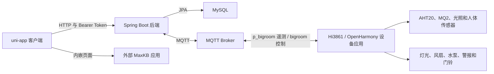

# Yijia 逸家智能家居

[English](README.md) | [简体中文](README.zh-CN.md)

Yijia 是一个智能家居原型项目，由 uni-app 客户端、Spring Boot 后端、MQTT 消息通信和 Hi3861/OpenHarmony 设备应用组成。项目围绕家庭、房间、成员、设备、操作记录和场景建立业务模型，并将软件界面与环境传感器及实体设备控制连接起来。

## 项目实现特点

- **面向家庭场景的数据模型：** 家庭下包含房间和设备，成员记录负责关联用户、家庭及其角色。
- **双向 IoT 通信链路：** Hi3861 上报房间遥测数据，后端解析并存储数据，客户端操作则转换为 MQTT 控制消息。
- **软件到硬件的控制映射：** 房间页面可以把灯光、风扇、水泵、警报和门铃操作转换为设备应用能够识别的命令字段。
- **场景组合：** 场景可以组合设备动作，并支持创建、编辑、查询和激活；客户端还会检查本地时间和人员状态条件。
- **外部服务集成：** 邮件服务用于注册和密码重置验证码，内嵌页面则提供外部 MaxKB 聊天应用入口。

## 核心使用流程

```text
账号与家庭
注册或登录 -> 选择家庭 -> 浏览房间 -> 查看设备

设备控制
进入房间 -> 选择灯光或风扇 -> 发送控制命令 -> 发布到 bigroom -> Hi3861 执行命令

遥测数据
Hi3861 采集传感器 -> 向 p_bigroom 发布 JSON -> 后端解析并保存 -> 客户端查询当前数据

智能场景
选择家庭 -> 创建场景 -> 选择设备动作和触发条件 -> 保存 -> 手动激活或由客户端本地检查

AI 页面
进入 AI 页签 -> 加载已配置的外部 MaxKB 聊天页面 -> 与该服务交互
```

AI 页面只是 iframe 集成入口，仓库中没有自主 AI 模型或已经完成的 MaxKB 后端 API 工作流。

## 系统架构



## Quick Start

### 1. 准备环境

安装或准备：

- JDK 8
- MySQL
- MQTT Broker
- 支持 uni-app 的 HBuilderX
- 当所选 HBuilderX 目标需要 npm 依赖时，还需 Node.js/npm

只有使用注册验证码和密码重置时才需要 SMTP；只有使用 AI 页面时才需要已部署的 MaxKB 聊天应用；只有运行实体设备链路时才需要 Hi3861/OpenHarmony SDK 和硬件。

### 2. 创建数据库

```sql
CREATE DATABASE smart CHARACTER SET utf8mb4 COLLATE utf8mb4_unicode_ci;
```

后端使用 Hibernate `ddl-auto=update` 创建或更新数据表。

### 3. 配置后端

启动前设置环境变量。后端会根据 `JWT_SECRET_KEY` 创建 HS256 签名密钥，因此该值至少需要 32 字节。

```powershell
$env:DB_USERNAME = "root"
$env:DB_PASSWORD = "your-database-password"
$env:JWT_SECRET_KEY = "replace-with-a-secret-of-at-least-32-bytes"
$env:MQTT_BROKER_URL = "tcp://localhost:1883"
$env:MQTT_USERNAME = ""
$env:MQTT_PASSWORD = ""
```

如需使用邮件流程，还需设置：

```powershell
$env:SPRING_MAIL_HOST = "smtp.example.com"
$env:MAIL_USERNAME = "your-smtp-account"
$env:MAIL_PASSWORD = "your-smtp-app-password"
```

后端默认值和占位配置位于 `backend/src/main/resources/application.properties`。

### 4. 启动后端

在 `backend/` 目录执行：

```powershell
.\mvnw.cmd clean package
.\mvnw.cmd spring-boot:run
```

API 默认监听 `http://localhost:8088`。

### 5. 配置并运行客户端

客户端 API 地址位于 `frontend/libs/request/index.js`，默认值为 `http://localhost:8088`。在手机或模拟器中运行时，需要把 `localhost` 替换为可以访问开发电脑的地址。

```powershell
cd frontend
npm install
```

使用 HBuilderX 打开 `frontend/` 并运行所需的 uni-app 目标，通过 HBuilderX 显示的浏览器、模拟器或设备地址访问客户端。当前仓库没有独立的 npm 构建脚本。

如需使用 AI 页签，应在运行前将 `frontend/pages/ai/ai.vue` 中的占位地址替换为已部署的 MaxKB 聊天页面地址。

### 6. 连接 Hi3861 设备应用（可选）

```powershell
Copy-Item firmware/hi3861-bigroom/config.example.h firmware/hi3861-bigroom/config.h
```

在 `config.h` 中设置 Wi-Fi SSID、Wi-Fi 密码、MQTT Broker 主机和端口，将 `firmware/hi3861-bigroom/` 加入兼容的 OpenHarmony 源码树，并按照相应 SDK 的 Hi3861 流程构建。固件和后端必须连接到同一个 MQTT Broker。

## 代表性 API 示例

以下示例使用后端默认地址。客户端会保存登录接口返回的 token，并在后续请求中添加 Bearer 请求头。

### 用户登录

`POST /api/auth/login` 接受手机号或邮箱，成功后以纯文本响应返回 JWT。

```bash
curl -X POST http://localhost:8088/api/auth/login \
  -H "Content-Type: application/json" \
  -d '{"identifier":"13800000000","password":"example-password"}'
```

```text
eyJhbGciOiJIUzI1NiJ9...
```

### 获取用户信息

`GET /api/auth/user?phone=...` 根据手机号返回用户信息，控制器会先清空密码字段。

```bash
curl "http://localhost:8088/api/auth/user?phone=13800000000" \
  -H "Authorization: Bearer <token>"
```

### 查询用户家庭

`GET /home/user/{userId}` 返回与指定用户关联的家庭。

```bash
curl http://localhost:8088/home/user/1 \
  -H "Authorization: Bearer <token>"
```

### 发送设备控制命令

`POST /api/mqtt/send` 将消息发布到指定 MQTT Topic，客户端设备控制工具使用的就是这个接口。

```bash
curl -X POST "http://localhost:8088/api/mqtt/send?topic=bigroom&message=liv_lit%3D1" \
  -H "Authorization: Bearer <token>"
```

该请求会发送 `liv_lit=1`，当前固件将其解释为客厅灯控制命令。

仓库中没有可以展示的本地 AI REST API；`frontend/pages/ai/ai.vue` 会直接加载外部 MaxKB 页面。

## MQTT Topic

后端通过 `mqtt.topic=p_bigroom,bigroom` 配置默认 Topic，Hi3861 设备应用中也使用了相同名称。

| Topic | 方向 | 用途 | 数据格式 |
| --- | --- | --- | --- |
| `p_bigroom` | Hi3861 发布，后端订阅 | 房间状态和传感器遥测 | JSON，包含 `temperature`、`humidity`、`gas`、`isHuman`、`liv_lit`、`fan_level`、`water_pump_level` 等字段 |
| `bigroom` | 后端发布，Hi3861 订阅 | 设备控制 | `liv_lit=1`、`kit_lit=0`、`fan_level=2` 等文本命令 |

代表性遥测数据：

```json
{
  "liv_lit": 1,
  "kit_lit": 0,
  "tol_lit": 0,
  "senser_on": 1,
  "fan_level": 2,
  "water_pump_level": 0,
  "bell": 0,
  "temperature": 24.6,
  "humidity": 51.2,
  "gas": 183,
  "adcdata": 628,
  "isHuman": 1,
  "sun": 1,
  "senser_light": 1,
  "alarmbell": 0
}
```

## 技术栈

- 客户端：uni-app、Vue 2 风格单文件组件、uView/uview-plus、Pinia、MQTT.js
- 后端：Java 8、Spring Boot 2.7.6、Spring Web、Spring Data JPA、Spring Security、JJWT、Spring Integration MQTT、Eclipse Paho、Spring Mail、Springfox
- 存储与消息：MySQL、MQTT
- 设备应用：C、OpenHarmony/Hi3861、CMSIS-RTOS、GPIO、PWM、AHT20、MQ2、Paho MQTTPacket

## 目录结构

```text
.
|-- frontend/                  # uni-app 客户端和页面
|-- backend/                   # REST API、数据持久化、邮件和 MQTT 集成
`-- firmware/
    `-- hi3861-bigroom/        # Hi3861/OpenHarmony 设备应用
```

## 认证与安全边界

登录接口会签发 JWT，客户端也会通过 `Authorization` 请求头发送 token。后端能够解析有效 token，但当前 Spring Security 对所有路由统一使用 `permitAll()`。因此，包括用户、家庭、房间、设备、场景、日志和 MQTT 管理在内的后端接口目前都没有强制身份认证。

这是原型阶段的限制。不要把当前后端直接暴露到不可信网络，也不要将其作为生产环境授权方案。生产实现应默认要求认证，从安全上下文获取用户身份，在服务边界检查家庭归属或角色，并限制 CORS 和调试接口。

## 当前限制

- 场景控制器使用占位用户 ID，场景归属检查尚不完整。
- AI 功能是外部页面嵌入，不是仓库内实现的 AI 服务。
- 客户端中的 API 和 AI 页面地址固定为本地开发值。
- 验证码保存在后端内存中，进程重启后会丢失。
- 前端以 HBuilderX 为主要运行环境，没有独立的 npm 构建脚本。
- 完整运行依赖单独配置的 MySQL、MQTT、SMTP、MaxKB、HBuilderX 和 OpenHarmony 环境。
